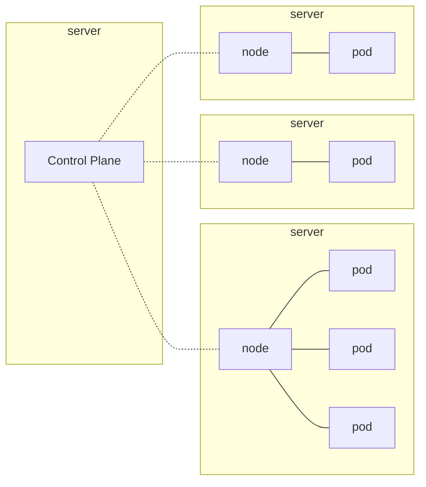
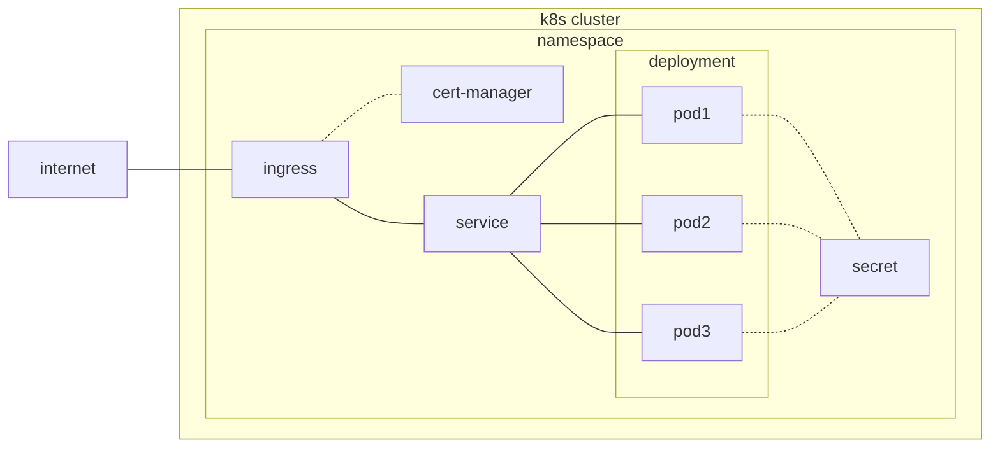

# Kubernetes

## Overview



* High-level view of Kubernetes cluster components
* In this example, the control level runs on its own server

---



* High-level view of Kubernetes Resources
* From the perspective of a single project

## Cluster Access

* Default cluster: `$HOME/.kube/config`
* Use othe cluster: `KUBECONFIG=~/.kube/server.yaml kubectl ..`
* Forward Kubernetes API: `ssh -NL 6443:127.0.01:6443 server01.example.com`

## Debugging

### Exec

```shell
# jump into existing container
kubectl exec --stdin --tty <pod-name> -- /bin/bash
```

### Port Forward

```shell
kubectl port-forward --namespace kube-system <pod.name> 9000:9000
```

### Run

```shell
# run a new container for debugging purpose
kubectl run toolbox --namespace apps --rm -i --tty --image debian -- bash
```

## Resource types

### Namespace

* Mechanism for isolating groups of resources

```shell
# create namespace
kubectl create namespace myapp

# list all namespaces
kubectl get namespace

# delete a namespace
kubectl delete namespace myapp

# set default namespace
kubectl config set-context --current --namespace=myapp

# get pods in namespace
kubectl --namespace myapp get pods
```

### Pods

* Pods are the smallest deployable units of computing that you can create and manage in Kubernetes
* A Pod is a group of one or more containers, with shared storage and network resources

```shell
# run pod
kubectl run awesome-app --image=nginx:latest

# list pods
kubectl get pods

# delete pod
kubectl delete pod awesome-app
```

### Deployment

* A deployment provides declarative updates for Pods
* Covers update process, health and more

```shell
# create deployment
kubectl apply -f deployment.yaml

# list deployments
kubectl get deployments

# delete deployment
kubectl delete deployment example-web
```

<details>
  <summary>deployment.yaml</summary>
  
```yaml
apiVersion: apps/v1
kind: Deployment
metadata:
  labels:
    app: example-web
  name: example-web
spec:
  replicas: 1
  selector:
    matchLabels:
      app: example-web
  template:
    metadata:
      labels:
        app: example-web
    spec:
      containers:
      - image: nginx:latest
        name: example-web
        resources:
          requests:
            cpu: 10m
            memory: 16Mi
          limits:
            cpu: 20m
            memory: 32Mi
```
  
</details>


### Secrets

* Object that contains a small amount of sensitive data such as a password, a token, or a key

```shell
# create secret
kubectl create secret generic <name> --from-file=<name1>=/tmp/test1 --from-file=<name2>=/tmp/regcred

# list secrets
kubectl get secrets

# get secret
kubectl get secret regcred --output=yaml
```

<details>
  <summary>Private Registry</summary>
  
Example `--from-file`-file:

```json
{"auths":{"registry.example.com":{"username":"<token-username>","password":"<token>","email":"<token-username>@example.com"}}}
```
  
</details>

### Service

* An ressource to expose an application running on a set of Pods as a network service

```shell
# get services
kubectl get services
```
  
### Node

* Kubernetes Nodes
  
```shell
# list all nodes
kubectl get node -o wide
```

## Tools

* [k9s](https://github.com/derailed/k9s) - provides a terminal UI to interact with Kubernetes
```shell
brew install k9s
k9s --namespace myapp
```
* [k3d](https://github.com/rancher/k3d) - lightweight wrapper to run [k3s](https://github.com/k3s-io/k3s/blob/master/README.md) in docker
```shell
brew install k3d
k3d cluster create mycluster --api-port 6550 -p "80:80@loadbalancer"
```
* [Helm](https://helm.sh/) - The package manager for Kubernetes
```shell
brew install helm
```
* [Lens](https://k8slens.dev/) - The Kubernetes IDE
```shell
brew install --cask lens
```
